Advanced Lane Finding
---
[](http://www.udacity.com/drive)

[](https://www.youtube.com/watch?v=sY47Zs5aN0c)

Introduction
---

The goals / steps of this project are the following:

* Compute the camera calibration matrix and distortion coefficients given a set of chessboard images.
* Apply a distortion correction to raw images.
* Use color transforms, gradients, etc., to create a thresholded binary image.
* Apply a perspective transform to rectify binary image ("birds-eye view").
* Detect lane pixels and fit to find the lane boundary.
* Determine the curvature of the lane and vehicle position with respect to center.
* Warp the detected lane boundaries back onto the original image.
* Output visual display of the lane boundaries and numerical estimation of lane curvature and vehicle position.

This project consists of the following major files and folders.

* Advanced_Lane_Finding.ipynb - Main source file
* Advanced_Lane_Finding.html - HTML extractor for main source file output. This can be used to see outputs without running Jupyter notebook
* camera_cal - Camera calibration images 
* input_videos - Input videos
* resources - Saved inputs  and outputs for writeup
* test_images -  Test road images
* utils - Test and R&D scripts 
* README.md - **Writeup for this project**
* advanced_lane_finding.py - Main pipeline debuger file[incomplete]

[Project running instructions](HOW_TO_RUN.md)

Image processing pipeline
---
Following flow chart will be described how this image processing pipeline development thing happening advanced computer vision techniques.  

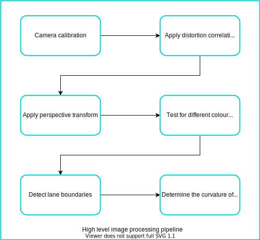

Camera calibration
---

Camera resectioning determines which incoming light is associated with each pixel on the resulting image [[Wikipedia](https://en.wikipedia.org/wiki/Camera_resectioning)]. 

##### Find and draw chessboard

Before calibration images, chessboard was detected from provided chessboard images by using OpenCV `cv2.findChessboardCorners` function. Following are the detected chessboard results. Red rectangle highlighted were not detected as chessboards. 

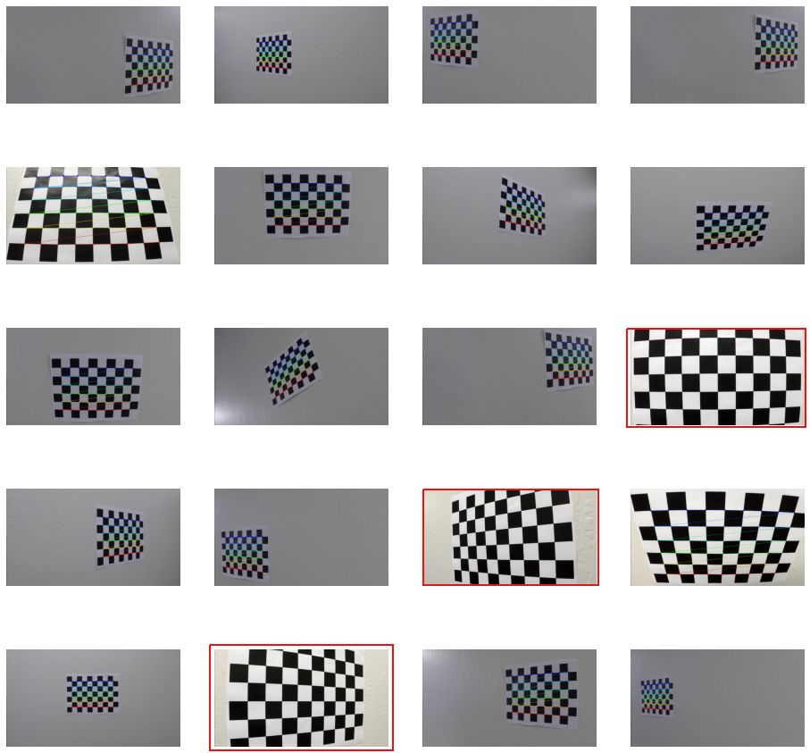

Here is the function that was used to find chessboard from images.

```python
# prepare objects points
objp = np.zeros((6*9, 3), np.float32)
objp[:,:2] = np.mgrid[0:9, 0:6].T.reshape(-1,2)

# Arrays to store object points and iamg points from all the images
objpoints = []
imgpoints = []

def find_and_draw_chessboard(img, pattern_size= (9,6)):
    gray = grayscale(img)

    # find the chessboard corners
    ret, corners = cv2.findChessboardCorners(gray, pattern_size, None)

    # if found, add object points, image points
    if ret:
        objpoints.append(objp)
        imgpoints.append(corners)

        # draw and display the corners
        cv2.drawChessboardCorners(img, pattern_size, corners, ret)
    
    # if not found, return same input image
    return img
```       

**Following OpenCV function was used to calibrate above chessboards found images**

```python
# Do Camera calibration given objects' points and images' points
# mtx - camera calibrated matrix
# dist - distortion cofficients
ret, mtx, dist, rvecs, tvecs = cv2.calibrateCamera(objpoints, imgpoints,img_size, None, None)

```
Above `mtx` and `dist` will be used to undistort images in the pipeline.

##### Distortion correction
**Image distortion** occurs when a camera looks at 3D objects in the real world and transforms them into a 2D image; this transformation isn’t perfect. Distortion actually changes what the shape and size of these 3D objects appear to be. So, the first step in analyzing camera images is to undo this distortion so that you can get correct and useful information out of them.

`cv2.undistort` can be used to corret distortion of images. Following are the sample images to show undistortion.

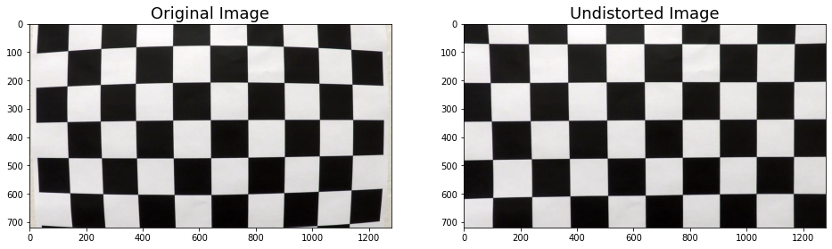


Perspective transformation
---
A perspective transform maps the points in a given image to different, desired, image points with a new perspective. The perspective transform is a bird’s-eye view transform that lets us view a lane from above; this will be useful for calculating the lane curvature later on. Aside from creating a bird’s eye view representation of an image, a perspective transform can also be used for all kinds of different viewpoints.

Perspective transformation can be done using the following steps.
##### Step 01: 
Select four source coordination points from a given image, and these points were used for all other test images.  
Selected **source** points:  
`p1 = (575, 465)` `p2 = (705, 465)` `p3 = (255, 685)` `p4 = (1050, 685)`   
Selected **destination** coordinates.  
`pd1 =(450, 0)` `pd2 = (width - 450, 0)` `pd3 = (450, height)` `pd4 = (width - 450, height)`  
Here height and width are respectively numbers of rows and number of columns in a raw image. Following is an image with a drawn polygon by using **source** points.

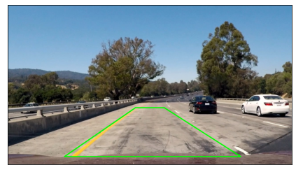

##### Step 02:
Apply OpenCV `cv2.getPerspectiveTransform` function to select a region as **bird-eye** view. Following function was used to warpe raw images.

```python
# define source and destination points for tranform
src = np.float32([p1, p2, p3, p4])
dst = np.float32([pd1, pd2, pd3, pd4])

def unwarp(img, source=src, desctination=dst):
    """
    This is used to select a region from a given undistortion image as bird eye perspective.
    
    :param img - Distortion corrected image
    :param src - source 
    :param dst - destination
    :return - warped image, transform matrix, and inverse
    """
    h,w = img.shape[:2]
    # use cv2.getPerspectiveTransform() to get M, the transform matrix, and Minv, the inverse
    M = cv2.getPerspectiveTransform(src, dst)
    Minv = cv2.getPerspectiveTransform(dst, src)
    # use cv2.warpPerspective() to warp your image to a top-down view
    warped = cv2.warpPerspective(img, M, (w,h), flags=cv2.INTER_LINEAR)
    return warped, M, Minv
    
```    
Here is the sample result of the above function.

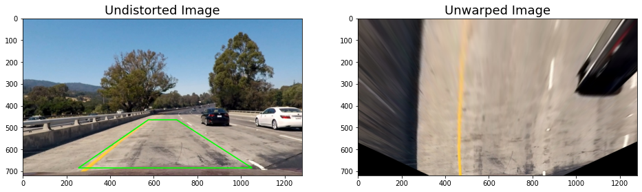

Working with color spaces and channels
---
We have to detect two major colors such that yellow and white on-road lane line images. By seeing the below color Venn diagram, we can get some idea about how other colours are making with three major colors. I have tested four-color spaces such that RGB, HSV, HLS, and LAB. 

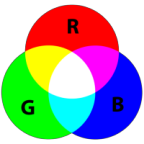

Following functions were used to extract color channels from color spaces.

```python
# These utilitis are used to extract different color channels from different color spaces.

# Extract R,G, and B color channels from RGB color space.
def extract_rgb_color_spaces(uwimg):
    unwarp_R = uwimg[:, :, 0]
    unwarp_G = uwimg[:, :, 1]
    unwarp_B = uwimg[:, :, 2]
    return unwarp_R,unwarp_G,unwarp_B

# Extract H,S, and V color channels from HSV color space.
def extract_hsv_color_spaces(uwimg):
    unwarp_HSV = cv2.cvtColor(uwimg, cv2.COLOR_RGB2HSV)
    unwarp_H = unwarp_HSV[:, :, 0]
    unwarp_S = unwarp_HSV[:, :, 1]
    unwarp_V = unwarp_HSV[:, :, 2]
    return unwarp_H,unwarp_S,unwarp_V

# Extract H,S, and L color channels from HLS color space.
def extract_hls_color_spaces(uwimg):
    unwarp_HLS = cv2.cvtColor(uwimg, cv2.COLOR_RGB2HLS)
    unwarp_HLS_H = unwarp_HLS[:, :, 0]
    unwarp_HLS_L = unwarp_HLS[:, :, 1]
    unwarp_HLS_S = unwarp_HLS[:, :, 2]
    
    return unwarp_HLS_H,unwarp_HLS_L,unwarp_HLS_S
    
# Extract L,A, and B color channels from LAB color space.
def extract_lab_color_spaces(uwimg):
    unwarped_LAB = cv2.cvtColor(uwimg, cv2.COLOR_RGB2Lab)
    unwarp_L = unwarped_LAB[:,:,0]
    unwarp_A = unwarped_LAB[:,:,1]
    unwarp_B = unwarped_LAB[:,:,2]
    return unwarp_L, unwarp_A,unwarp_B
    
```    
I have applied the above functions to detect lane lines edges from road images. Following are the results that I got with each color filter. I have tested two different images to detect lane lines.

##### RGB color space results
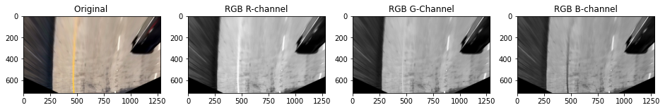
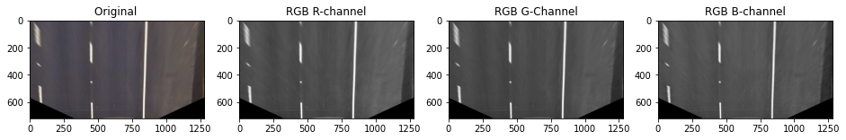

##### HSV color space results
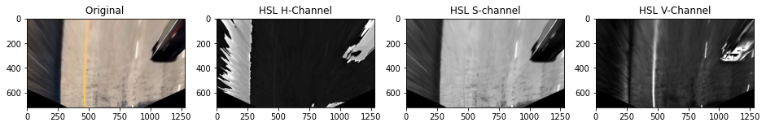


##### HLS color space results

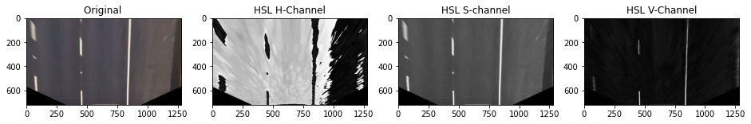

##### LAB color space results
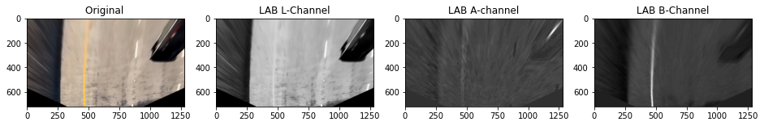


##### Color spaces conclusions
**LAB** color space **B** was performed well to detect yellow lane lines from the road images. For white lane lines, we have few options to select color channels. **HLS** **L** was performed well to detect white lane lines from road images.

With the above conclusion, I select only two color channels to apply gradient threshold filters. 

### Gradient threshold
When we are detecting edges from road images, the Canny edge detection will detect all other edges. We have to minimize those unnecessary edge detections. One of the improved version of Canny edge detection is **Sobel operator**[[Wikipedia](https://en.wikipedia.org/wiki/Sobel_operator)].  Applying the Sobel operator to an image is a way of taking the derivative of the image in the x or y direction.

#### Sobel absolute threshold
The following function was used to apply Sobel absolute filter

```python
def abs_sobel_thresh(gray, orient='x', thresh_min=0, thresh_max=255):
    """
    This is used to create abinary image using a grayscaled image. 
    
    :param gray - Grayscaled or binary image
    :param orient - x or y derections of the image
    :param thresh_min - minimum value for binary threshold
    :param thresh_max - maximum value for binary threshold
    :return - A binary image after appying Sobel absolute threshold
    """
    # Apply the following steps to img
    # 1) Take the derivative in x or y given orient = 'x' or 'y'
    dx = 1 if orient=='x'  else  0
    dy = 1 if orient=='y'  else  0

    sobel = cv2.Sobel(gray, cv2.CV_64F,dx ,dy)
    # 2) Take the absolute value of the derivative or gradient
    abs_sobel = np.absolute(sobel)
    # 3) Scale to 8-bit (0 - 255) then convert to type = np.uint8
    scaled_sobel = np.uint8(255*abs_sobel/np.max(abs_sobel))
    # 4) Create a mask of 1's where the scaled gradient magnitude
            # is > thresh_min and < thresh_max
        
    binary_sobel = np.zeros_like(scaled_sobel)
    binary_sobel[(scaled_sobel >= thresh_min) & (scaled_sobel <= thresh_max)] = 1
    
    return binary_sobel

```
Following are the some of results after applying the above filter.


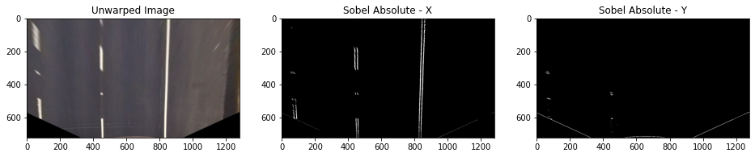

#### Sobel direction of the gradient
The magnitude or absolute value of the gradient is just the square root of the squares of the individual x and y gradients. For a gradient in both the **x** and **y** directions, the magnitude is the square root of the sum of the squares. The following function was used to calculate the direction of the gradient.

```python
def dir_threshold(gray, sobel_kernel=3, thresh=(0, np.pi/2)):
    """
    This is used to generate sobel direction of the warped gray images
    """
    # Calculate the x and y gradients
    sobelx = cv2.Sobel(gray, cv2.CV_64F, 1, 0, ksize=sobel_kernel)
    sobely = cv2.Sobel(gray, cv2.CV_64F, 0, 1, ksize=sobel_kernel)
    # Take the absolute value of the gradient direction, 
    # apply a threshold, and create a binary image result
    absgraddir = np.arctan2(np.absolute(sobely), np.absolute(sobelx))
    
    binary_output =  np.ones_like(absgraddir)
    
    binary_output[(absgraddir >= thresh[0]) & (absgraddir <= thresh[1])] = 0

    # Return the binary image
    return binary_output
```
And the following were a few results after applying a Sobel gradient direction filter.

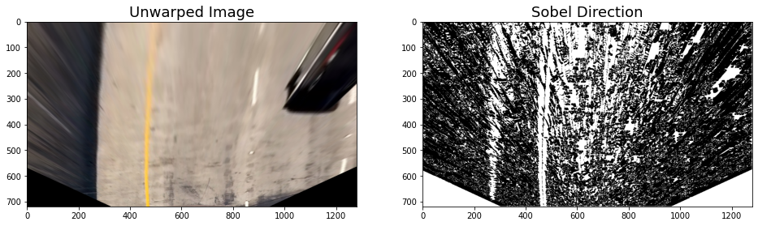
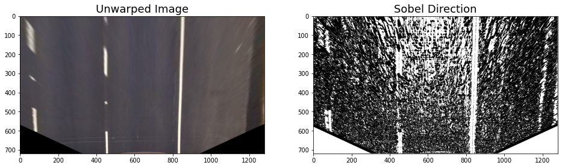

After applying the above Sobel gradient and Sobel absolute filter, we can notice how both filters' results are varying for two colors such that yellow and white. Now we can combine both filters and can see how the combined filter is working for both yellow and white lane lines. The following function was used to combine filters.

```python
def combine_thresholds(unwarp_img, gray, mag_kernel, mag_thresh, dir_thresh, dir_kernel ):
    """
    This is used to combine sobel magnitude and sobel direction gradients.
    """
    gradx = abs_sobel_thresh(gray, orient='x', thresh_min=mag_thresh[0], thresh_max=mag_thresh[1])
    grady = abs_sobel_thresh(gray, orient='y', thresh_min=mag_thresh[0], thresh_max=mag_thresh[1])
    
    mag_binary = mag_threshold(gray, sobel_kernel=mag_kernel, mag_thresh=mag_thresh)
    
    dir_binary = dir_threshold(gray, sobel_kernel=dir_kernel, thresh=dir_thresh)
    
    combined = np.zeros_like(dir_binary)
    combined[((gradx == 1) & (grady == 1)) | ((mag_binary == 1) & (dir_binary == 1))] = 1
    
    # A combine binary image 
    return combined
```
Following are the few results for the combined filter.

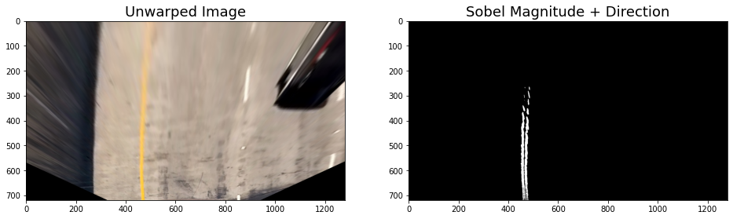
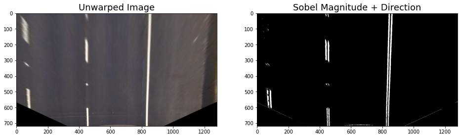

#### Normalize color channels
HLS L channel and LAB B was performed well to detect yellow and white lane lines. Now we can normalize both color channels to smooth edges. Following functions were used to normalize color channels.

######  Normalize HLS L color channel

```python
def hls_l_nomalize(img, thresh=(220, 255)):
    """
    This is used to nomalize HLS L color channel
    """
    # 1) Convert to HLS color space
    _,hls_l,_ = extract_hls_color_spaces(img)
    hls_l = hls_l*(255/np.max(hls_l))
    # 2) Apply a threshold to the L channel
    binary_output = np.zeros_like(hls_l)
    binary_output[(hls_l > thresh[0]) & (hls_l <= thresh[1])] = 1
    # 3) Return a binary image of threshold result
    return binary_output

```

######  Normalize LAB B color channel

```python
def lab_b_nomalize(unwarped_img, thresh=(190,255)):
    """
    This is used to LAB B color channel
    """
    _,_,lab_b = extract_lab_color_spaces(unwarped_img)
    # don't normalize if there are no yellows in the image
    if np.max(lab_b) > 175:
        lab_b = lab_b*(255/np.max(lab_b))
    # 2) Apply a threshold to the L channel
    binary_output = np.zeros_like(lab_b)
    binary_output[((lab_b > thresh[0]) & (lab_b <= thresh[1]))] = 1
    # 3) Return a binary image of threshold result
    return binary_output
```

Following are the results of the above filters respectively.

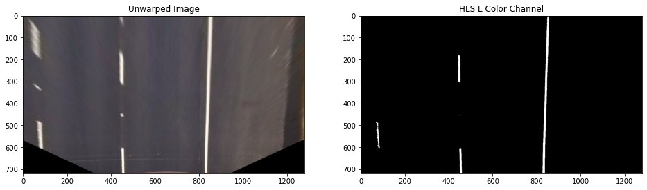
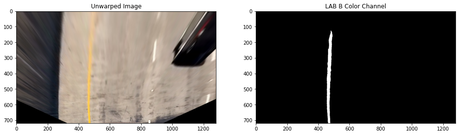

#### Image pipeline
```python
def pipeline(p_img):
    
    # Undistort images
    undistort_img = undistort(p_img)
    
    # Persfective transform
    img_unwarp,M, Minv = unwarp(undistort_img, src, dst)
    
    # HLS L-channel Threshold (using default parameters)
    img_hls_L = hls_l_nomalize(img_unwarp)

    # Lab B-channel Threshold (using default parameters)
    img_lab_B = lab_b_nomalize(img_unwarp)
    
    # Combine HLS and Lab B channel thresholds
    combined = np.zeros_like(img_lab_B)
    combined[(img_hls_L == 1) | (img_lab_B == 1)] = 1
    
    return combined, Minv
    
```
Following are a few samples of pipeline output.

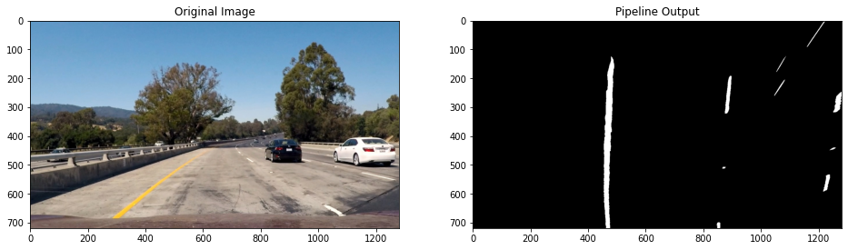
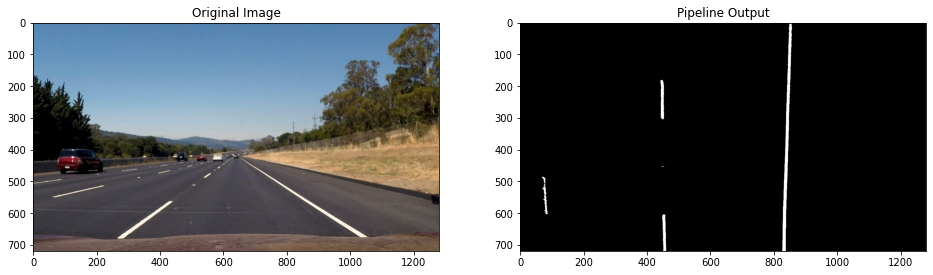

The above pipeline can be used to continue next steps in image processing.


Detect lane boundaries
---
To detect lane boundarie, we can peak in a histogram. As we notice around the lane boundaries, the average white pixel density is higher than comparatively other regions. Using the following function, we can generate histogram data points from a binary image. 

```python
def hist(img):
    """
    This is used to extract data points for a histogram
    """
    # Grab only the bottom half of the image
    bottom_half = img[img.shape[0]//2:,:]
    # Sum across image pixels vertically - make sure to set an `axis`
    # i.e. the highest areas of vertical lines should be larger values
    histogram = np.sum(bottom_half, axis=0)
    
    return histogram
```
Following are the image and it's relevant lane line boundaries histogram  

 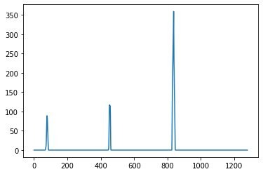


The pipeline's extracted binary image, pixels are either 0 or 1, so the two most prominent peaks in this histogram will be good indicators of the x-position of the base of the lane lines. We can use that as a starting point for where to search for the lines. From that point, we can use a sliding window, placed around the line centers to find and follow the lines up to the top of the frame.

#### Implement sliding windows and fit a polynomial
We can use the two highest peaks from our histogram as a starting point for determining where the lane lines are, and then use sliding windows moving upward in the image (further along the road) to determine where the lane lines go.

###### Split the histogram for the two lines
The first step we'll take is to split the histogram into two sides, one for each lane line. Following are the used functions' utilities to split histogram for the two-lane lines.

```python
# Take a histogram of the bottom half of the image
histogram = np.sum(img[img.shape[0]//2:,:], axis=0)
# Find the peak of the left and right halves of the histogram
# These will be the starting point for the left and right lines
midpoint = np.int(histogram.shape[0]//2)
quarter_point = np.int(midpoint//2)
# Previously the left/right base was the max of the left/right half of the histogram
# this changes it so that only a quarter of the histogram (directly to the left/right) is considered
leftx_base = np.argmax(histogram[quarter_point:midpoint]) + quarter_point
rightx_base = np.argmax(histogram[midpoint:(midpoint+quarter_point)]) + midpoint
```

###### Set up windows and window hyperparameters
The next step is to set a few hyperparameters related to our sliding windows, and set them up to iterate across the binary activations in the image.

```python
# Choose the number of sliding windows
nwindows = 10
# Set height of windows
window_height = np.int(img.shape[0]/nwindows)
# Identify the x and y positions of all nonzero pixels in the image
nonzero = img.nonzero()
nonzeroy = np.array(nonzero[0])
nonzerox = np.array(nonzero[1])
# Current positions to be updated for each window
leftx_current = leftx_base
rightx_current = rightx_base
# Set the width of the windows +/- margin
margin = 80
# Set minimum number of pixels found to recenter window
minpix = 40
# Create empty lists to receive left and right lane pixel indices
left_lane_inds = []
right_lane_inds = []
# Rectangle data for visualization
rectangle_data = []

```

###### Iterate through selected windows to track curvature

```python
# Step through the windows one by one
for window in range(nwindows):
    # Identify window boundaries in x and y (and right and left)
    win_y_low = img.shape[0] - (window+1)*window_height
    win_y_high = img.shape[0] - window*window_height
    win_xleft_low = leftx_current - margin
    win_xleft_high = leftx_current + margin
    win_xright_low = rightx_current - margin
    win_xright_high = rightx_current + margin
    rectangle_data.append((win_y_low, win_y_high, win_xleft_low, win_xleft_high, win_xright_low, win_xright_high))
    # Identify the nonzero pixels in x and y within the window
    good_left_inds = ((nonzeroy >= win_y_low) & (nonzeroy < win_y_high) & (nonzerox >= win_xleft_low) & (nonzerox < win_xleft_high)).nonzero()[0]
    good_right_inds = ((nonzeroy >= win_y_low) & (nonzeroy < win_y_high) & (nonzerox >= win_xright_low) & (nonzerox < win_xright_high)).nonzero()[0]
    # Append these indices to the lists
    left_lane_inds.append(good_left_inds)
    right_lane_inds.append(good_right_inds)
    # If you found > minpix pixels, recenter next window on their mean position
    if len(good_left_inds) > minpix:
        leftx_current = np.int(np.mean(nonzerox[good_left_inds]))
    if len(good_right_inds) > minpix:        
        rightx_current = np.int(np.mean(nonzerox[good_right_inds]))
```

###### Fit a polynomial

```python
# Concatenate the arrays of indices
left_lane_inds = np.concatenate(left_lane_inds)
right_lane_inds = np.concatenate(right_lane_inds)

# Extract left and right line pixel positions
leftx = nonzerox[left_lane_inds]
lefty = nonzeroy[left_lane_inds] 
rightx = nonzerox[right_lane_inds]
righty = nonzeroy[right_lane_inds] 

left_fit, right_fit = (None, None)
# Fit a second order polynomial to each
if len(leftx) != 0:
    left_fit = np.polyfit(lefty, leftx, 2)
if len(rightx) != 0:
    right_fit = np.polyfit(righty, rightx, 2)
```

Note: Complete function can be found [`Advanced_Lane_Finding.ipynb`](Advanced_Lane_Finding.ipynb)file.  
Following are showing original image and expected output after applying above functions.

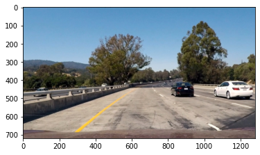 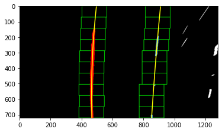

Now we can use the above frames to fit left and right lane lines with second-order polynomial functions. The following function was used to fit second-order polynomials.

```python
def polyfit_using_prev_fit(binary_warped, left_fit_prev, right_fit_prev):
    nonzero = binary_warped.nonzero()
    nonzeroy = np.array(nonzero[0])
    nonzerox = np.array(nonzero[1])
    margin = 80
    left_lane_inds = ((nonzerox > (left_fit_prev[0]*(nonzeroy**2) + left_fit_prev[1]*nonzeroy + left_fit_prev[2] - margin)) & 
                      (nonzerox < (left_fit_prev[0]*(nonzeroy**2) + left_fit_prev[1]*nonzeroy + left_fit_prev[2] + margin))) 
    right_lane_inds = ((nonzerox > (right_fit_prev[0]*(nonzeroy**2) + right_fit_prev[1]*nonzeroy + right_fit_prev[2] - margin)) & 
                       (nonzerox < (right_fit_prev[0]*(nonzeroy**2) + right_fit_prev[1]*nonzeroy + right_fit_prev[2] + margin)))  

    # Again, extract left and right line pixel positions
    leftx = nonzerox[left_lane_inds]
    lefty = nonzeroy[left_lane_inds] 
    rightx = nonzerox[right_lane_inds]
    righty = nonzeroy[right_lane_inds]
    
    left_fit_new, right_fit_new = (None, None)
    if len(leftx) != 0:
        # Fit a second order polynomial to each
        left_fit_new = np.polyfit(lefty, leftx, 2)
    if len(rightx) != 0:
        right_fit_new = np.polyfit(righty, rightx, 2)
        
    return left_fit_new, right_fit_new, left_lane_inds, right_lane_inds
```

The `polyfit_using_prev_fit` function performs basically the same task. But alleviates much difficulty of the search process by leveraging a previous fit and only searching for lane pixels within a certain range of that fit. And following is the above function results.

 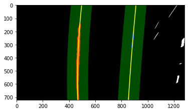

Determine curvature of the lane line
---
In this step, we'll find the curvature of the left and right lanes. By using the `polyfit_using_prev_fit` function we can locate lane line pixels, used their **x** and **y** pixel positions to fit a  second-order polynomial curve.

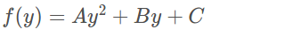

We are fitting for `f(y)` rather than `f(x)` because the lane lines in the warped image(bird-eye view) are near vertical and may have the same x value for more than one y value.


Source: https://video.udacity-data.com/topher/2016/December/58449a23_color-fit-lines/color-fit-lines.jpg


#### Radius of curvature
The radius of curvature at any point x of the function x=f(y) is given as follows: 

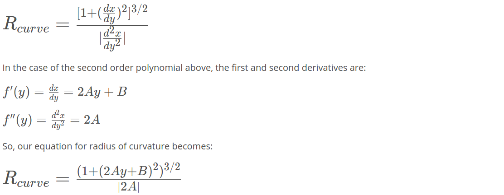

The following Python snippet was used to calculate the left and right lane lines' radius of curvatures. 

```python
left_curverad = ((1 + (2*left_fit_cr[0]*y_eval*ym_per_pix + left_fit_cr[1])**2)**1.5) / np.absolute(2*left_fit_cr[0])
right_curverad = ((1 + (2*right_fit_cr[0]*y_eval*ym_per_pix + right_fit_cr[1])**2)**1.5) / np.absolute(2*right_fit_cr[0])
```

And the following snippet was used to calculate distance from the center.

```python
car_position = bin_img.shape[1]/2
l_fit_x_int = l_fit[0]*h**2 + l_fit[1]*h + l_fit[2]
r_fit_x_int = r_fit[0]*h**2 + r_fit[1]*h + r_fit[2]
lane_center_position = (r_fit_x_int + l_fit_x_int) /2
center_dist = (car_position - lane_center_position) * xm_per_pix
```

Note: The complete function can be found from [`Advanced_Lane_Finding.ipynb`](Advanced_Lane_Finding.ipynb) file and the function will be `calc_curv_rad_and_center_dist`. 

#### Draw lane and text data onto road images
Following functions were used to finalize road lane polygon drawing and results were attached after the code snippets. 

###### Draw lane lines
```python
def draw_lane(original_img):
    original_img_bin, Minv = pipeline(original_img) 
    l_fit,r_fit,_,_,_ = sliding_window_polyfit(original_img_bin)
    
    new_img = np.copy(original_img)
    if l_fit is None or r_fit is None:
        return original_img
    # Create an image to draw the lines on
    warp_zero = np.zeros_like(original_img_bin).astype(np.uint8)
    color_warp = np.dstack((warp_zero, warp_zero, warp_zero))
    
    h,w = original_img_bin.shape
    ploty = np.linspace(0, h-1, num=h)# to cover same y-range as image
    left_fitx = l_fit[0]*ploty**2 + l_fit[1]*ploty + l_fit[2]
    right_fitx = r_fit[0]*ploty**2 + r_fit[1]*ploty + r_fit[2]

    # Recast the x and y points into usable format for cv2.fillPoly()
    pts_left = np.array([np.transpose(np.vstack([left_fitx, ploty]))])
    pts_right = np.array([np.flipud(np.transpose(np.vstack([right_fitx, ploty])))])
    pts = np.hstack((pts_left, pts_right))

    # Draw the lane onto the warped blank image
    cv2.fillPoly(color_warp, np.int_([pts]), (0,255, 0))
    cv2.polylines(color_warp, np.int32([pts_left]), isClosed=False, color=(255,0,255), thickness=15)
    cv2.polylines(color_warp, np.int32([pts_right]), isClosed=False, color=(0,255,255), thickness=15)

    # Warp the blank back to original image space using inverse perspective matrix (Minv)
    newwarp = cv2.warpPerspective(color_warp, Minv, (w, h)) 
    # Combine the result with the original image
    result = cv2.addWeighted(new_img, 1, newwarp, 0.5, 0)
    return result
```    

The following function was used to show radius curvature and distance from center values.

```python
def draw_data(original_img, curv_rad, center_dist):
    new_img = np.copy(original_img)
    h = new_img.shape[0]
    font = cv2.FONT_HERSHEY_DUPLEX
    text = 'Curve radius: ' + '{:04.2f}'.format(curv_rad) + 'm'
    cv2.putText(new_img, text, (40,70), font, 1.5, (200,255,155), 2, cv2.LINE_AA)
    direction = ''
    if center_dist > 0:
        direction = 'right'
    elif center_dist < 0:
        direction = 'left'
    abs_center_dist = abs(center_dist)
    text = '{:04.3f}'.format(abs_center_dist) + 'm ' + direction + ' of center'
    cv2.putText(new_img, text, (40,120), font, 1.5, (200,255,155), 2, cv2.LINE_AA)
    
    return new_img
```   

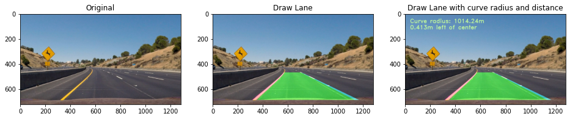

#### Video pipeline
After drawing lane lines, the final pipeline was built with the following functions and the class. The outputs were stored at the `[output_videos](/output_videos)` directory and I provided those external uploaded links under the *Results* section.

```python
# Define a class to receive the characteristics of each line detection
class Line():
    def __init__(self):
        # was the line detected in the last iteration?
        self.detected = False  
        # x values of the last n fits of the line
        self.recent_xfitted = [] 
        #average x values of the fitted line over the last n iterations
        self.bestx = None     
        #polynomial coefficients averaged over the last n iterations
        self.best_fit = None  
        #polynomial coefficients for the most recent fit
        self.current_fit = []  
        #radius of curvature of the line in some units
        self.radius_of_curvature = None 
        #distance in meters of vehicle center from the line
        self.line_base_pos = None 
        #difference in fit coefficients between last and new fits
        self.diffs = np.array([0,0,0], dtype='float') 
        #number of detected pixels
        self.px_count = None
        
    def add_fit(self, fit, inds):
        # add a found fit to the line, up to n
        if fit is not None:
            if self.best_fit is not None:
                # if we have a best fit, see how this new fit compares
                self.diffs = abs(fit-self.best_fit)
            if (self.diffs[0] > 0.001 or \
               self.diffs[1] > 1.0 or \
               self.diffs[2] > 100.) and \
               len(self.current_fit) > 0:
                # bad fit! abort! abort! ... well, unless there are no fits in the current_fit queue, then we'll take it
                self.detected = False
            else:
                self.detected = True
                self.px_count = np.count_nonzero(inds)
                self.current_fit.append(fit)
                if len(self.current_fit) > 5:
                    # throw out old fits, keep newest n
                    self.current_fit = self.current_fit[len(self.current_fit)-5:]
                self.best_fit = np.average(self.current_fit, axis=0)
        # or remove one from the history, if not found
        else:
            self.detected = False
            if len(self.current_fit) > 0:
                # throw out oldest fit
                self.current_fit = self.current_fit[:len(self.current_fit)-1]
            if len(self.current_fit) > 0:
                # if there are still any fits in the queue, best_fit is their average
                self.best_fit = np.average(self.current_fit, axis=0)
```
```python
def process_image(img):
    new_img = np.copy(img)
    img_bin, Minv = pipeline(new_img)
    
    # if both left and right lines were detected last frame, use polyfit_using_prev_fit, otherwise use sliding window
    if not l_line.detected or not r_line.detected:
        l_fit, r_fit, l_lane_inds, r_lane_inds, _ = sliding_window_polyfit(img_bin)
    else:
        l_fit, r_fit, l_lane_inds, r_lane_inds = polyfit_using_prev_fit(img_bin, l_line.best_fit, r_line.best_fit)
        
    # invalidate both fits if the difference in their x-intercepts isn't around 350 px (+/- 100 px)
    if l_fit is not None and r_fit is not None:
        # calculate x-intercept (bottom of image, x=image_height) for fits
        h = img.shape[0]
        l_fit_x_int = l_fit[0]*h**2 + l_fit[1]*h + l_fit[2]
        r_fit_x_int = r_fit[0]*h**2 + r_fit[1]*h + r_fit[2]
        x_int_diff = abs(r_fit_x_int-l_fit_x_int)
        if abs(350 - x_int_diff) > 100:
            l_fit = None
            r_fit = None
            
    l_line.add_fit(l_fit, l_lane_inds)
    r_line.add_fit(r_fit, r_lane_inds)
    
    # draw the current best fit if it exists
    if l_line.best_fit is not None and r_line.best_fit is not None:
        img_out1 = draw_lane(new_img)
        rad_l, rad_r, d_center = calc_curv_rad_and_center_dist(img_bin, l_line.best_fit, r_line.best_fit, 
                                                               l_lane_inds, r_lane_inds)
        img_out = draw_data(img_out1, (rad_l+rad_r)/2, d_center)
    else:
        img_out = new_img
    
    return img_out
```
```
def plot_fit_onto_img(img, fit, plot_color):
    if fit is None:
        return img
    new_img = np.copy(img)
    h = new_img.shape[0]
    ploty = np.linspace(0, h-1, h)
    plotx = fit[0]*ploty**2 + fit[1]*ploty + fit[2]
    pts = np.array([np.transpose(np.vstack([plotx, ploty]))])
    cv2.polylines(new_img, np.int32([pts]), isClosed=False, color=plot_color, thickness=8)
    return new_img 
```    
Results
---
After applying the above individual functions, we can create an image processing pipeline, and then it can be applied to process video inputs. Their utility functions to finalize project challenge video. Using the following link final project challenge and other challenges output can be found.

|[Project Video](https://youtu.be/sY47Zs5aN0c)|[Challenge Video](https://youtu.be/KhoOvG-FdAU)|[Hard Challenge Video](https://youtu.be/J_VD-1X547o)|
|---------------------------------------------|-----------------------------------------------|----------------------------------------------------|

Discussions
---
This is was a great experience to play with the polynomial approach to detect lane lines. But lighting is the worst case for edge detections. Even there were test images without any kind of road lane lines, edges were detected due to shadow boundaries. 

Color thresholding was used to detect lane lines, LAB B color channel was helped to detect yellow lane lines. For white lane lines, there were multiple color channels supported with clear edges, due to lightning issues HSL S was selected to combine white and yellow lanes.  

Histogram based search algorithm was supported to find curve radius if we can try to annotate images using neural network approaches that prebuild model can be used to speed up our algorithm. Especially to process a small video clip will take some considerable time, but in a real-world case, the vehicle speed will be slow down very badly to take time to do the image processing pipeline and decision-making time will be increased due to image processing time.  

References
---
* [Self-Driving Car Project Q&A | Advanced Lane Finding](https://www.youtube.com/watch?v=vWY8YUayf9Q)
* [Introduction to Computer Vision - Udacity](https://www.udacity.com/course/introduction-to-computer-vision--ud810)
* [Self driving can engineer - Udacity](https://www.udacity.com/course/self-driving-car-engineer-nanodegree--nd013)
* [OpenCV official documents](https://docs.opencv.org/4.4.0/index.html)
* [OpenCV my git repo C++ samples](https://github.com/snandasena/opencv-cpp-examples)
* [CS231n: Convolutional Neural Networks for Visual Recognition](http://cs231n.stanford.edu/)
* [What Is Camera Calibration?](https://www.mathworks.com/help/vision/ug/camera-calibration.html)
* [Ross Kippenbrock - Finding Lane Lines for Self Driving Cars](https://www.youtube.com/watch?v=VyLihutdsPk)
* [Radius of Curvature](https://www.intmath.com/applications-differentiation/8-radius-curvature.php)
* [Multivariable calculus - Khan Acedemy](https://www.khanacademy.org/math/multivariable-calculus)
* [MIT Deep Learning and Artificial Intelligence Lectures](https://deeplearning.mit.edu/)


Acknowledgments
---
Big thank you to [Udacity](https://www.udacity.com) for providing the template code for this project.
